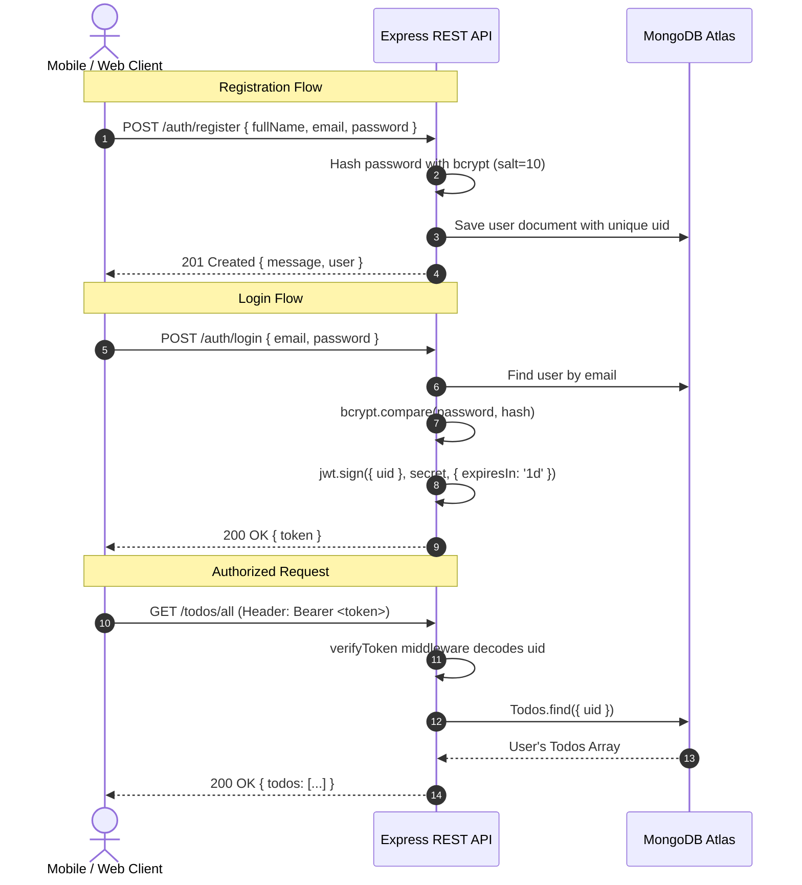

# 🚀 Taskly — RESTful API Backend

<p align="center">
  
  
  
  
</p>

<p align="center">
  A robust, production-grade <strong>Node.js & Express RESTful API</strong> that powers the <strong>Taskly</strong> productivity ecosystem. Built with stateless <strong>JWT Authentication</strong>, user-isolated <strong>MongoDB / Mongoose</strong> persistence, and in-memory <strong>Cloudinary</strong> asset streaming for seamless task attachments.
</p>

<p align="center">
  
  
  
  
  
</p>

---

## 📑 Table of Contents

- [Key Features](#-key-features)
- [Architecture & Tech Stack](#-architecture--tech-stack)
- [Project Directory Structure](#-project-directory-structure)
- [Prerequisites](#-prerequisites)
- [Installation & Quick Start](#-installation--quick-start)
- [Environment Variables](#-environment-variables)
- [API Reference & Documentation](#-api-reference--documentation)
  - [System Health](#1-system-health)
  - [Authentication Endpoints](#2-authentication-endpoints)
  - [Todo & Task Management Endpoints](#3-todo--task-management-endpoints)
- [Authentication Workflow](#-authentication-workflow)
- [Deployment Guide](#-deployment-guide)
- [Security Best Practices](#-security-best-practices)
- [License & Author](#-license--author)

---

## ✨ Key Features

- 🔐 **Stateless JWT Authentication:** Secure registration and login using industry-standard **bcrypt** (salt rounds = 10) password hashing and JSON Web Tokens.
- 🛡️ **User-Isolated Data Access:** Multi-tenant architecture ensuring each user only accesses, modifies, or deletes their own tasks via verified `uid` injection in request context.
- ☁️ **Cloudinary Image Streaming:** Zero disk footprint file uploads via `multer.memoryStorage()`, directly streaming binary buffers to Cloudinary CDN folders.
- ⚡ **Express 5.x Asynchronous Core:** Modern asynchronous request pipelines with centralized error handling and non-blocking I/O.
- 🌐 **Cross-Origin Resource Sharing (CORS):** Preconfigured CORS middleware for effortless communication with Expo/React Native mobile clients and web frontends.
- 📅 **Rich Task Attributes:** Support for custom task priority (`low`, `medium`, `high`), due dates & times, completion status toggling, and image attachments.

---

## 🛠️ Architecture & Tech Stack

| Layer | Technology | Purpose |
| :--- | :--- | :--- |
| **Runtime** | [Node.js](https://nodejs.org/) (v18+) | Server-side JavaScript runtime engine |
| **Web Framework** | [Express 5](https://expressjs.com/) | REST API router and HTTP middleware handler |
| **Database** | [MongoDB Atlas](https://www.mongodb.com/atlas) | Document-oriented NoSQL cloud database |
| **ODM** | [Mongoose 9](https://mongoosejs.com/) | Schema definition, validation, and database abstraction |
| **Security** | [bcrypt](https://www.npmjs.com/package/bcrypt) & [jsonwebtoken](https://jwt.io/) | Cryptographic password hashing & token verification |
| **Asset Storage** | [Cloudinary SDK](https://cloudinary.com/) | Cloud storage & image CDN delivery |
| **File Parser** | [Multer](https://github.com/expressjs/multer) | In-memory `multipart/form-data` processing |
| **Dev Tools** | [Nodemon](https://nodemon.io/) & [dotenv](https://github.com/motdotla/dotenv) | Live-reload dev environment and environment variable loading |

---

## 📂 Project Directory Structure

```text
Taskly-Server/
├── config/
│   ├── cloudinary.js       # Cloudinary SDK credentials & configuration
│   ├── db.js               # MongoDB connection lifecycle handler
│   └── global.js           # Unique identifier generator utility
├── middlewares/
│   └── auth.js             # Bearer JWT verification & context injection (req.uid)
├── models/
│   ├── auth.js             # User Schema (fullName, email, password, uid)
│   └── todos.js            # Todo Schema (title, dueDate, priority, imageURL, etc.)
├── routes/
│   ├── auth.js             # Authentication routes (/register, /login, /user)
│   └── todos.js            # Todo CRUD routes (/create, /all, /single, /update)
├── .env.example            # Sample environment variables template
├── .gitignore              # Files and folders ignored by Git
├── index.js                # Server entry point & Express middleware initialization
├── package.json            # Project dependencies and operational scripts
└── README.md               # API specification and developer documentation
```

---

## 📋 Prerequisites

Before running the server, verify you have the following installed:

- **Node.js**: `v18.0.0` or higher ([Download](https://nodejs.org/))
- **npm**: `v9.0.0` or higher (bundled with Node)
- **MongoDB Database**: A free MongoDB Atlas cluster URI or a local MongoDB instance.
- **Cloudinary Account**: Free Cloudinary credentials for image storage.

---

## 🚀 Installation & Quick Start

### 1. Clone & Enter Directory
```bash
git clone https://github.com/SufyanAli-7/Taskly-Server.git
cd Taskly-Server
```

### 2. Install Dependencies
```bash
npm install
```

### 3. Setup Environment Variables
Create a `.env` file in the root of `Taskly-Server` by copying the provided `.env.example`:

```bash
cp .env.example .env
```

Open `.env` and fill in your actual credentials (see [Environment Variables](#-environment-variables)).

### 4. Run the Server

**Development Mode (Hot-Reload with Nodemon):**
```bash
npm run dev
```

**Production Mode:**
```bash
npm start
```

Upon successful startup, the console will output:
```text
Connected to MongoDB
Server is running on port 8000
```

---

## 🔐 Environment Variables

The server requires the following configuration values defined in your `.env` file:

| Variable | Description | Example / Default |
| :--- | :--- | :--- |
| `PORT` | Port number on which Express listens | `8000` |
| `MONGODB_URI` | MongoDB Atlas or local connection string | `mongodb+srv://<user>:<password>@cluster.mongodb.net/taskly` |
| `CLOUDINARY_CLOUD_NAME` | Cloudinary account Cloud Name | `your_cloud_name` |
| `CLOUDINARY_API_KEY` | Cloudinary API Key | `123456789012345` |
| `CLOUDINARY_API_SECRET` | Cloudinary API Secret Key | `abcdefghijklmnopqrstuvwxyz` |

> [!CAUTION]
> Never commit your active `.env` file with live database credentials or API secrets to version control. Always keep `.env` listed in `.gitignore`.

---

## 📡 API Reference & Documentation

**Base URL**: `http://localhost:8000` (or `http://<YOUR_LAN_IP>:8000` for physical mobile devices)

---

### 1. System Health

#### `GET /`
Returns a welcome timestamp proving the server is running.
- **Response `200 OK`**:
  ```text
  Hello! Today's date is 10/4/2026, 5:30:00 PM
  ```

#### `GET /health`
Liveness probe useful for cloud orchestrators (Render, Railway, Docker, AWS).
- **Response `200 OK`**:
  ```text
  OK
  ```

---

### 2. Authentication Endpoints

#### `POST /auth/register`
Creates a new user profile with bcrypt-hashed credentials and unique `uid`.

- **Headers**: `Content-Type: application/json`
- **Request Body**:
  ```json
  {
    "fullName": "Jane Doe",
    "email": "jane@example.com",
    "password": "SecretPassword123"
  }
  ```
- **Response `201 Created`**:
  ```json
  {
    "message": "User registered successfully",
    "user": {
      "uid": "k8h29dj29023",
      "fullName": "Jane Doe",
      "email": "jane@example.com"
    }
  }
  ```
- **Response `401 Unauthorized`** (If user already exists):
  ```json
  {
    "message": "User already exists",
    "isError": true
  }
  ```

---

#### `POST /auth/login`
Authenticates user credentials and issues a signed JSON Web Token (1-day expiry).

- **Headers**: `Content-Type: application/json`
- **Request Body**:
  ```json
  {
    "email": "jane@example.com",
    "password": "SecretPassword123"
  }
  ```
- **Response `200 OK`**:
  ```json
  {
    "message": "Login successful",
    "token": "eyJhbGciOiJIUzI1NiIsInR5cCI6IkpXVCJ9..."
  }
  ```
- **Response `401 Unauthorized`**:
  ```json
  {
    "message": "Invalid email or password",
    "isError": true
  }
  ```

---

#### `GET /auth/user`
Fetches the current authenticated user's profile based on the JWT Bearer token.

- **Headers**: 
  - `Authorization: Bearer <JWT_TOKEN>`
- **Response `200 OK`**:
  ```json
  {
    "message": "User fetched successfully",
    "user": {
      "uid": "k8h29dj29023",
      "fullName": "Jane Doe",
      "email": "jane@example.com"
    }
  }
  ```

---

### 3. Todo & Task Management Endpoints

All endpoints below require a valid **Bearer Token** in the `Authorization` header.

```http
Authorization: Bearer <YOUR_JWT_TOKEN>
```

---

#### `POST /todos/create`
Creates a new task. Supports optional multi-part file upload for task attachment images.

- **Headers**: 
  - `Authorization: Bearer <JWT_TOKEN>`
  - `Content-Type: multipart/form-data`
- **Form Data Fields**:
  - `title` *(String, Required)*: Task title
  - `description` *(String, Optional)*: Detailed task notes
  - `dueDate` *(String, Optional)*: e.g. `"Oct 5, 2026, 5:30 PM"`
  - `priority` *(String, Optional)*: `"low"`, `"medium"`, or `"high"`
  - `image` *(File, Optional)*: Binary image (JPEG/PNG)
- **Response `201 Created`**:
  ```json
  {
    "message": "Todo created successfully",
    "todo": {
      "id": "e93kd92k01",
      "uid": "k8h29dj29023",
      "title": "Design Mobile Mockups",
      "description": "Finalize Figma designs for Taskly dashboard",
      "dueDate": "Oct 5, 2026, 5:30 PM",
      "priority": "high",
      "status": "active",
      "isCompleted": false,
      "imageURL": "https://res.cloudinary.com/dvdvw8azo/image/upload/v1234/images/sample.jpg",
      "imagePublicId": "images/sample",
      "createdAt": "2026-10-04T12:00:00.000Z",
      "updatedAt": "2026-10-04T12:00:00.000Z"
    }
  }
  ```

---

#### `GET /todos/all`
Fetches all todos belonging to the authenticated user.

- **Headers**: `Authorization: Bearer <JWT_TOKEN>`
- **Response `200 OK`**:
  ```json
  {
    "todos": [
      {
        "id": "e93kd92k01",
        "uid": "k8h29dj29023",
        "title": "Design Mobile Mockups",
        "dueDate": "Oct 5, 2026, 5:30 PM",
        "priority": "high",
        "status": "active",
        "isCompleted": false,
        "imageURL": "https://res.cloudinary.com/..."
      }
    ]
  }
  ```

---

#### `GET /todos/single/:id`
Fetches a single task by its unique ID, strictly constrained to the requesting user's `uid`.

- **Headers**: `Authorization: Bearer <JWT_TOKEN>`
- **URL Parameters**: `id` — The unique ID of the todo.
- **Response `200 OK`**:
  ```json
  {
    "todos": {
      "id": "e93kd92k01",
      "uid": "k8h29dj29023",
      "title": "Design Mobile Mockups",
      "isCompleted": false
    }
  }
  ```

---

#### `PATCH /todos/update`
Updates task fields (completion toggle, title, due date, priority, description).

- **Headers**: 
  - `Authorization: Bearer <JWT_TOKEN>`
  - `Content-Type: application/json`
- **Request Body**:
  ```json
  {
    "id": "e93kd92k01",
    "title": "Design Mobile Mockups (Updated)",
    "description": "Figma screens reviewed and approved",
    "dueDate": "Oct 6, 2026, 12:00 PM",
    "priority": "medium",
    "status": "completed",
    "isCompleted": true
  }
  ```
- **Response `201 Created`**:
  ```json
  {
    "message": "Todo updated successfully",
    "todo": {
      "id": "e93kd92k01",
      "title": "Design Mobile Mockups (Updated)",
      "isCompleted": true,
      "status": "completed"
    }
  }
  ```

---

#### `DELETE /todos/single/:id`
Deletes a task permanently from the database.

- **Headers**: `Authorization: Bearer <JWT_TOKEN>`
- **URL Parameters**: `id` — The unique ID of the task to delete.
- **Response `200 OK`**:
  ```json
  {
    "message": "Todo deleted successfully",
    "todos": {
      "id": "e93kd92k01"
    }
  }
  ```

---

## 🔒 Authentication Workflow



---

## 🚢 Deployment Guide

This server is production-ready for deployment on platforms like **Render**, **Railway**, **Fly.io**, or **Heroku**:

### Deploying to Render
1. Create a new **Web Service** and connect your GitHub repository.
2. Set Environment to **Node**.
3. Set **Build Command**: `npm install`
4. Set **Start Command**: `npm start`
5. In the **Environment Variables** tab, define:
   - `PORT`: `8000`
   - `MONGODB_URI`: `<Your MongoDB URI>`
   - `CLOUDINARY_CLOUD_NAME`: `<Your Cloud Name>`
   - `CLOUDINARY_API_KEY`: `<Your API Key>`
   - `CLOUDINARY_API_SECRET`: `<Your API Secret>`
6. Deploy! Render will provide an HTTPS endpoint (e.g., `https://taskly-api.onrender.com`).

---

## 🛡️ Security Best Practices

- **Password Hashing:** Passwords are never stored in plaintext. They are salted and hashed using `bcrypt` (10 rounds).
- **Password Exclusion:** The `/auth/user` endpoint explicitly executes `.select("-password")` to prevent sensitive hash leakage.
- **Resource Ownership:** All task queries filter by `uid: req.uid`. Users cannot modify or inspect other users' tasks even if they guess task IDs.
- **Memory Buffer Cleanup:** Multer streams memory buffers straight to Cloudinary without writing files to local disk, minimizing disk attack vectors.

---

## 👤 Author & Support

- **Author:** Sufyan Ali
- **GitHub:** [@SufyanAli-7](https://github.com/SufyanAli-7)
- **Project:** Taskly Taskly Server

---

<p align="center">
  <sub>Built with ❤️ using Node.js, Express, MongoDB, and Cloudinary.</sub>
</p>
